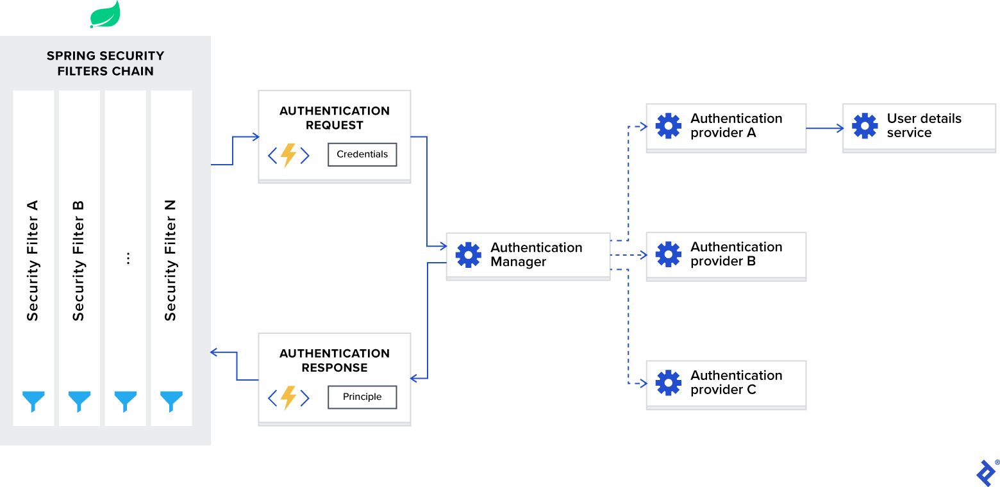

```shell
from https://www.toptal.com/spring/spring-security-tutorial
```
Spring在Java生态系统中被认为是一个值得信赖的框架，并且被广泛使用。将Spring称为框架不再有效，因为它更像是一个涵盖各种框架的总括术语。其中一个框架是Spring Security，它是一个强大且可定制的**Authentication**和**Authorization**框架。它被认为是保护基于Spring的应用程序的事实标准，因此，如果您希望实现Spring JWT令牌解决方案，那么将其建立在Spring Security的基础上是有意义的。
如果后端基于Java和Spring，那么将Spring Security与JWT一起用于身份验证/授权并将其配置为无状态通信是有意义的。虽然有很多文章解释了如何做到这一点，但对我来说，第一次设置它仍然令人沮丧，我不得不阅读和总结来自多个来源的信息。这就是为什么我决定编写这个Spring Security教程，在这里我将尝试总结和涵盖您在配置过程中可能遇到的所有必要的细微细节和弱点。
如果后端基于Java和Spring，那么将Spring Security与JWT一起用于身份验证/授权并将其配置为无状态通信是有意义的。虽然有很多文章解释了如何做到这一点，但对我来说，第一次设置它仍然令人沮丧，我不得不阅读和总结来自多个来源的信息。这就是为什么我决定编写这个Spring Security教程，在这里我将尝试总结和涵盖您在配置过程中可能遇到的所有必要的细微细节和弱点。
## 术语定义
在深入研究技术细节之前，我想明确定义Spring Security上下文中使用的术语，以确保我们都使用相同的语言。
以下是我们需要定义的术语：

- **Authentication** 是指根据提供的凭据验证用户身份的过程。一个常见的例子是在登录网站时输入用户名和密码。你可以把它看作是对你是谁这个问题的回答。
- **Authorization** 是指在假设用户成功通过身份验证的情况下，确定用户是否具有执行特定操作或读取特定数据的适当权限的过程。你可以把它看作是对用户能做/读这个问题的回答。
- **Principle** 指的是当前经过身份验证的用户。
- **Granted authority** 是指经过身份验证的用户的权限。
- **Role** 指经过身份验证的用户的一组权限。
## 创建一个简单的Spring应用
在转到Spring Security框架的配置之前，让我们创建一个基本的Spring web应用程序。为此，我们可以使用Spring Initializer并生成一个模板项目。对于一个简单的web应用程序，只有一个Spring web框架依赖项就足够了：
```xml
<dependencies>
    <dependency>
        <groupId>org.springframework.boot</groupId>
        <artifactId>spring-boot-starter-web</artifactId>
    </dependency>
</dependencies>
```
一旦我们创建了项目，我们就可以向其中添加一个简单的REST Controller，如下所示：
```java
@RestController @RequestMapping("hello")
public class HelloRestController {

    @GetMapping("user")
    public String helloUser() {
        return "Hello User";
    }

    @GetMapping("admin")
    public String helloAdmin() {
        return "Hello Admin";
    }

}
```
之后，如果我们构建并运行项目，我们可以在web浏览器中访问以下URL：

- http://localhost:8080/hello/user 会返回 string Hello User.
- http://localhost:8080/hello/admin 会返回 string Hello Admin.

现在，我们可以将Spring Security框架添加到我们的项目中，我们可以通过将以下依赖项添加到pom.xml 文件中来实现这一点：
```java
<dependencies>
    <dependency>
      <groupId>org.springframework.boot</groupId>
      <artifactId>spring-boot-starter-security</artifactId>
    </dependency>
</dependencies>
```
在我们提供相应的配置之前，添加其他Spring框架依赖项通常不会对应用程序产生立竿见影的效果，但Spring Security的不同之处在于它确实具有立竿见肘的效果，这通常会让新用户感到困惑。添加后，如果我们重建并运行项目，然后尝试访问上述URL之一而不是查看结果，我们将被重定向到http://localhost:8080/login 这是默认行为，因为Spring Security框架要求对所有URL进行开箱即用的身份验证。
要通过身份验证，我们可以使用默认用户名user，并在控制台中找到自动生成的密码：
```java
Using generated security password: 1fc15145-dfee-4bec-a009-e32ca21c77ce
```
请记住，每次重新运行应用程序时，密码都会更改。如果我们想改变这种行为并使密码保持静态，我们可以将以下配置添加到application.properties文件中：
```java
spring.security.user.password=Test12345_
```
现在，如果我们在登录表单中输入凭据，我们将被重定向回我们的URL，我们将看到正确的结果。请注意，开箱即用的身份验证过程是基于会话的，如果我们想注销，我们可以访问以下URL：http://localhost:8080/logout
这种开箱即用的行为可能对经典的MVC web应用程序有用，在这些应用程序中，我们有基于会话的身份验证，但在单页应用程序的情况下，它通常没有用处，因为在大多数用例中，我们都有client rendering和基于JWT的无状态身份验证。在这种情况下，我们将不得不大量定制Spring Security框架，这将在本文的剩余部分中进行。
例如，我们将实现一个经典的 [bookstore web application](https://github.com/Yoh0xFF/java-spring-security-example) ，并创建一个后端，该后端将提供CRUD API来创建作者和书籍，以及用于用户管理和身份验证的API。
## Spring Security 架构概览
在开始自定义配置之前，我们先讨论一下Spring Security身份验证在幕后是如何工作的。
下图显示了流程，并显示了如何处理身份验证请求：
**Spring Security Architecture**

现在，让我们将这个图分解为多个组件，并分别讨论每个组件。
### Spring Security Filters Chain
当您将Spring Security框架添加到应用程序中时，它会自动注册一个过滤器链，该过滤器链会拦截所有传入的请求。这个链由各种过滤器组成，每个过滤器都处理一个特定的用例。
例如：

- 根据配置，检查请求的URL是否可公开访问。
- 如果是基于会话的身份验证，请检查用户是否已经在当前会话中进行了身份验证。
- 检查用户是否有权执行请求的操作，依此类推。

我想提到的一个重要细节是，Spring Security过滤器是以最低顺序注册的，并且是最先调用的过滤器。对于某些用例，如果您想将自定义过滤器放在它们前面，则需要在它们的顺序中添加填充。这可以通过以下配置来完成：
```java
spring.security.filter.order=10
// 或者
 http.addFilterBefore(jwtAuthenticationTokenFilter, UsernamePasswordAuthenticationFilter.class);
```
一旦我们将此配置添加到application.properties文件中，我们将在SpringSecurity过滤器前面有10个自定义过滤器的空间。
### AuthenticationManager
您可以将AuthenticationManager视为一个协调器，在其中您可以注册多个提供程序，并根据请求类型将身份验证请求传递给正确的提供程序。
### AuthenticationProvider
AuthenticationProvider 处理特定类型的身份验证。它的接口只公开两个函数：

- authenticate 对请求进行认证。
- supports 查看当前的provider 是否支持这个 authentication type.

我们在示例项目中使用的当前接口的一个重要实现是DaoAuthenticationProvider，它从UserDetailsService检索用户详细信息。
### UserDetailsService
UserDetailsService 被描述为在Spring文档中加载用户特定数据的核心接口。
在大多数用例中，身份验证提供程序根据数据库中的凭据提取用户身份信息，然后执行验证。由于这个用例非常常见，Spring开发人员决定将其提取为一个单独的接口，从而公开单个函数：

- loadUserByUsername 接受username作为参数并返回user identity对象。
## Authentication Using JWT with Spring Security
在讨论了Spring Security框架的内部结构之后，让我们将其配置为使用JWT令牌进行无状态身份验证。
为了自定义Spring Security以供JWT使用，我们需要在类路径中使用@EnableWebSecurity注释来注释配置类。此外，为了简化自定义过程，该框架公开了一个WebSecurityConfigurerAdapter类。我们将扩展此适配器并覆盖其两个功能，以便：
```java
WebSecurityConfigurerAdapter已弃用，见https://spring.io/blog/2022/02/21/spring-security-without-the-websecurityconfigureradapter。
可通过自行配置配置类来添加以下的功能。
```

1. Configure the authentication manager with the correct provider
2. Configure web security (public URLs, private URLs, authorization, etc.)
```java
@EnableWebSecurity
public class SecurityConfig extends WebSecurityConfigurerAdapter {

    @Override
    protected void configure(AuthenticationManagerBuilder auth) throws Exception {
        // TODO configure authentication manager
    }

    @Override
    protected void configure(HttpSecurity http) throws Exception {
        // TODO configure web security
    }

}
```
在我们的示例应用程序中，我们将用户标识存储在users集合中的MongoDB数据库中。这些标识由User实体映射，它们的CRUD操作由UserRepo Spring Data repository定义。
现在，当我们接受身份验证请求时，我们需要使用提供的凭据从数据库中检索正确的身份，然后进行验证。为此，我们需要实现UserDetailsService接口，其定义如下：
```java
public interface UserDetailsService {

    UserDetails loadUserByUsername(String username)
            throws UsernameNotFoundException;

}
```
在这里，我们可以看到，它需要返回实现UserDetails接口的对象，并且我们的User实体实现了它（有关实现的详细信息，请参阅示例项目的存储库）。考虑到UserDetailsService只公开了单个函数原型，我们可以将其视为一个函数接口，并将其作为lambda表达式提供实现。
```java
@EnableWebSecurity
public class SecurityConfig extends WebSecurityConfigurerAdapter {

    private final UserRepo userRepo;

    public SecurityConfig(UserRepo userRepo) {
        this.userRepo = userRepo;
    }

    @Override
    protected void configure(AuthenticationManagerBuilder auth) throws Exception {
        auth.userDetailsService(username -> userRepo
            .findByUsername(username)
            .orElseThrow(
                () -> new UsernameNotFoundException(
                    format("User: %s, not found", username)
                )
            ));
    }

    // Details omitted for brevity

}
```
在这里，auth.userDetailsService函数调用将使用我们对UserDetailsService接口的实现来启动DaoAuthenticationProvider实例，并将其注册到authentication manager中。
除了身份验证提供程序，我们还需要为authentication manager配置正确的密码编码模式，用于凭据验证。为此，我们需要将PasswordEncoder接口的首选实现公开为bean。
```java
PasswordEncoder的作用是将原始密码加密后和存储的密码进行比对。
前提是：存储的密码和原始密码通过某种已知的加密方式加密而存储的
建议的存储格式为：
{bcrypt}$2a$10$MF7hYnWLeLT66gNccBgxaONZHbrSMjlUofkp50sSpBw2PJjUqU.zS
{sha256}97cde38028ad898ebc02e690819fa220e88c62e0699403e94fff291cfffaf8410849f27605abcbc0
```
在我们的示例项目中，我们将使用bcrypt密码哈希算法。
```java
@EnableWebSecurity
public class SecurityConfig extends WebSecurityConfigurerAdapter {

    private final UserRepo userRepo;

    public SecurityConfig(UserRepo userRepo) {
        this.userRepo = userRepo;
    }

    @Override
    protected void configure(AuthenticationManagerBuilder auth) throws Exception {
        auth.userDetailsService(username -> userRepo
            .findByUsername(username)
            .orElseThrow(
                () -> new UsernameNotFoundException(
                    format("User: %s, not found", username)
                )
            ));
    }

    @Bean
    public PasswordEncoder passwordEncoder() {
        return new BCryptPasswordEncoder();
    }

    // Details omitted for brevity

}
```
配置了authentication manager之后，我们现在需要配置web security。我们正在实现REST API，需要使用JWT令牌进行无状态身份验证；因此，我们需要设置以下选项：

- Enable [CORS](https://en.wikipedia.org/wiki/Cross-origin_resource_sharing) and disable [CSRF](https://en.wikipedia.org/wiki/Cross-site_request_forgery).
- Set session management to stateless.
- Set unauthorized requests exception handler.
- Set permissions on endpoints.
- Add JWT token filter.

此配置的实现方式如下:
```java
@EnableWebSecurity
public class SecurityConfig extends WebSecurityConfigurerAdapter {

    private final UserRepo userRepo;
    private final JwtTokenFilter jwtTokenFilter;

    public SecurityConfig(UserRepo userRepo,
                          JwtTokenFilter jwtTokenFilter) {
        this.userRepo = userRepo;
        this.jwtTokenFilter = jwtTokenFilter;
    }

    // Details omitted for brevity

    @Override
    protected void configure(HttpSecurity http) throws Exception {
        // Enable CORS and disable CSRF
        http = http.cors().and().csrf().disable();

        // Set session management to stateless
        http = http
            .sessionManagement()
            .sessionCreationPolicy(SessionCreationPolicy.STATELESS)
            .and();

        // Set unauthorized requests exception handler
        http = http
            .exceptionHandling()
            .authenticationEntryPoint(
                (request, response, ex) -> {
                    response.sendError(
                        HttpServletResponse.SC_UNAUTHORIZED,
                        ex.getMessage()
                    );
                }
            )
            .and();

        // Set permissions on endpoints
        http.authorizeRequests()
            // Our public endpoints
            .antMatchers("/api/public/**").permitAll()
            .antMatchers(HttpMethod.GET, "/api/author/**").permitAll()
            .antMatchers(HttpMethod.POST, "/api/author/search").permitAll()
            .antMatchers(HttpMethod.GET, "/api/book/**").permitAll()
            .antMatchers(HttpMethod.POST, "/api/book/search").permitAll()
            // Our private endpoints
            .anyRequest().authenticated();

        // Add JWT token filter
        http.addFilterBefore(
            jwtTokenFilter,
            UsernamePasswordAuthenticationFilter.class
        );
    }

    // Used by Spring Security if CORS is enabled.
    @Bean
    public CorsFilter corsFilter() {
        UrlBasedCorsConfigurationSource source =
            new UrlBasedCorsConfigurationSource();
        CorsConfiguration config = new CorsConfiguration();
        config.setAllowCredentials(true);
        config.addAllowedOrigin("*");
        config.addAllowedHeader("*");
        config.addAllowedMethod("*");
        source.registerCorsConfiguration("/**", config);
        return new CorsFilter(source);
    }

}
```
注：部分方法已被弃用，现在SpringSecurity推荐使用lamda表达式：
```java
// 以下为改变
http.cors(); http.cors(withDefaults());

http.csrf().disable(); http.csrf(AbstractHttpConfigurer::disable);

http.sessionManagement().sessionCreationPolicy(SessionCreationPolicy.STATELESS);
http.sessionManagement((a)->{a.sessionCreationPolicy(SessionCreationPolicy.STATELESS);});
```
请注意，我们在Spring Security内部UsernamePasswordAuthenticationFilter之前添加了JwtTokenFilter。我们这样做是因为此时我们需要访问用户身份来执行身份验证/授权，并且它的提取是在基于所提供JWT令牌的JWT令牌过滤器中进行的。具体实施方式如下：
```java
@Component
public class JwtTokenFilter extends OncePerRequestFilter {

    private final JwtTokenUtil jwtTokenUtil;
    private final UserRepo userRepo;

    public JwtTokenFilter(JwtTokenUtil jwtTokenUtil,
                          UserRepo userRepo) {
        this.jwtTokenUtil = jwtTokenUtil;
        this.userRepo = userRepo;
    }

    @Override
    protected void doFilterInternal(HttpServletRequest request,
                                    HttpServletResponse response,
                                    FilterChain chain)
            throws ServletException, IOException {
        // Get authorization header and validate
        final String header = request.getHeader(HttpHeaders.AUTHORIZATION);
        if (isEmpty(header) || !header.startsWith("Bearer ")) {
            chain.doFilter(request, response);
            return;
        }

        // Get jwt token and validate
        final String token = header.split(" ")[1].trim();
        if (!jwtTokenUtil.validate(token)) {
            chain.doFilter(request, response);
            return;
        }

        // Get user identity and set it on the spring security context
        UserDetails userDetails = userRepo
            .findByUsername(jwtTokenUtil.getUsername(token))
            .orElse(null);

        UsernamePasswordAuthenticationToken
            authentication = new UsernamePasswordAuthenticationToken(
                userDetails, null,
                userDetails == null ?
                    List.of() : userDetails.getAuthorities()
            );

        authentication.setDetails(
            new WebAuthenticationDetailsSource().buildDetails(request)
        );

        SecurityContextHolder.getContext().setAuthentication(authentication);
        chain.doFilter(request, response);
    }

}
```
在实现我们的登录API功能之前，我们需要多做一步——我们需要authentication manager的访问权。默认情况下，它是不可公开访问的，我们需要在配置类中将它显式公开为bean。
这可以按如下方式进行：
```java
@EnableWebSecurity
public class SecurityConfig extends WebSecurityConfigurerAdapter {

    // Details omitted for brevity

    @Override @Bean
    public AuthenticationManager authenticationManagerBean() throws Exception {
        return super.authenticationManagerBean();
    }

}
```
现在，我们已经准备好实现登录API功能：
```java
@Api(tags = "Authentication")
@RestController @RequestMapping(path = "api/public")
public class AuthApi {

    private final AuthenticationManager authenticationManager;
    private final JwtTokenUtil jwtTokenUtil;
    private final UserViewMapper userViewMapper;

    public AuthApi(AuthenticationManager authenticationManager,
                   JwtTokenUtil jwtTokenUtil,
                   UserViewMapper userViewMapper) {
        this.authenticationManager = authenticationManager;
        this.jwtTokenUtil = jwtTokenUtil;
        this.userViewMapper = userViewMapper;
    }

    @PostMapping("login")
    public ResponseEntity<UserView> login(@RequestBody @Valid AuthRequest request) {
        try {
            Authentication authenticate = authenticationManager
                .authenticate(
                    new UsernamePasswordAuthenticationToken(
                        request.getUsername(), request.getPassword()
                    )
                );

            User user = (User) authenticate.getPrincipal();

            return ResponseEntity.ok()
                .header(
                    HttpHeaders.AUTHORIZATION,
                    jwtTokenUtil.generateAccessToken(user)
                )
                .body(userViewMapper.toUserView(user));
        } catch (BadCredentialsException ex) {
            return ResponseEntity.status(HttpStatus.UNAUTHORIZED).build();
        }
    }

}
```
在这里，我们使用authentication manager验证所提供的凭据，如果成功，我们将生成JWT令牌，并将其作为响应标头以及响应主体中的用户身份信息返回。
## JWT Authorization with Spring Security
在上一节中，我们设置了一个SpringJWT身份验证过程，并配置了公共/私有URL。这对于简单的应用程序来说可能已经足够了，但对于大多数真实世界的用例，我们总是需要为用户提供基于角色的访问策略。在本章中，我们将解决这个问题，并使用SpringSecurity框架建立一个基于角色的授权模式。
在我们的示例应用程序中，我们定义了以下三个角色：

- USER_ADMIN allows us to manage application users.
- AUTHOR_ADMIN allows us to manage authors.
- BOOK_ADMIN allows us to manage books.

现在，我们需要将它们应用于相应的URL：

- api/public is publicly accessible.
- api/admin/user can access users with the USER_ADMIN role.
- api/author can access users with the AUTHOR_ADMIN role.
- api/book can access users with the BOOK_ADMIN role.

Spring Security框架为我们提供了两个设置授权模式的选项：

- URL-based configuration
- Annotation-based configuration

首先，让我们看看基于URL的配置是如何工作的。它可以应用于web安全配置，如下所示：
```java
@EnableWebSecurity
public class SecurityConfig extends WebSecurityConfigurerAdapter {

    // Details omitted for brevity

    @Override
    protected void configure(HttpSecurity http) throws Exception {
        // Enable CORS and disable CSRF
        http = http.cors().and().csrf().disable();

        // Set session management to stateless
        http = http
            .sessionManagement()
            .sessionCreationPolicy(SessionCreationPolicy.STATELESS)
            .and();

        // Set unauthorized requests exception handler
        http = http
            .exceptionHandling()
            .authenticationEntryPoint(
                (request, response, ex) -> {
                    response.sendError(
                        HttpServletResponse.SC_UNAUTHORIZED,
                        ex.getMessage()
                    );
                }
            )
            .and();

        // Set permissions on endpoints
        http.authorizeRequests()
            // Our public endpoints
            .antMatchers("/api/public/**").permitAll()
            .antMatchers(HttpMethod.GET, "/api/author/**").permitAll()
            .antMatchers(HttpMethod.POST, "/api/author/search").permitAll()
            .antMatchers(HttpMethod.GET, "/api/book/**").permitAll()
            .antMatchers(HttpMethod.POST, "/api/book/search").permitAll()
            // Our private endpoints
            .antMatchers("/api/admin/user/**").hasRole(Role.USER_ADMIN)
            .antMatchers("/api/author/**").hasRole(Role.AUTHOR_ADMIN)
            .antMatchers("/api/book/**").hasRole(Role.BOOK_ADMIN)
            .anyRequest().authenticated();

        // Add JWT token filter
        http.addFilterBefore(
            jwtTokenFilter,
            UsernamePasswordAuthenticationFilter.class
        );
    }

    // Details omitted for brevity

}
```
正如您所看到的，这种方法简单明了，但也有一个缺点。我们的应用程序中的授权模式可能很复杂，如果我们在一个地方定义所有规则，它将变得非常大、复杂且难以阅读。正因为如此，我通常更喜欢使用基于注释的配置。
Spring Security框架为web安全性定义了以下注释：

- @PreAuthorize supports [Spring Expression Language](https://www.baeldung.com/spring-expression-language) and is used to provide expression-based access control _before_ executing the method.
- @PostAuthorize supports [Spring Expression Language](https://www.baeldung.com/spring-expression-language) and is used to provide expression-based access control _after_ executing the method (provides the ability to access the method result).
- @PreFilter supports [Spring Expression Language](https://www.baeldung.com/spring-expression-language) and is used to filter the collection or arrays _before_ executing the method based on custom security rules we define.
- @PostFilter supports [Spring Expression Language](https://www.baeldung.com/spring-expression-language) and is used to filter the returned collection or arrays _after_ executing the method based on custom security rules we define (provides the ability to access the method result).
- @Secured doesn’t support [Spring Expression Language](https://www.baeldung.com/spring-expression-language) and is used to specify a list of roles on a method.
- @RolesAllowed doesn’t support [Spring Expression Language](https://www.baeldung.com/spring-expression-language) and is the [JSR 250](https://en.wikipedia.org/wiki/JSR_250)’s equivalent annotation of the @Secured annotation.

默认情况下，这些注释是禁用的，可以在我们的应用程序中启用，如下所示：
```java
@EnableWebSecurity
@EnableGlobalMethodSecurity(
    securedEnabled = true,
    jsr250Enabled = true,
    prePostEnabled = true
)
public class SecurityConfig extends WebSecurityConfigurerAdapter {

    // Details omitted for brevity

}
```

securedEnabled = true enables @Secured annotation.
jsr250Enabled = true enables @RolesAllowed annotation.
prePostEnabled = true enables @PreAuthorize, @PostAuthorize, @PreFilter, @PostFilter annotations.
启用后，我们可以在API端点上强制执行基于角色的访问策略，如下所示：
```java
@Api(tags = "UserAdmin")
@RestController @RequestMapping(path = "api/admin/user")
@RolesAllowed(Role.USER_ADMIN)
public class UserAdminApi {

	// Details omitted for brevity

}

@Api(tags = "Author")
@RestController @RequestMapping(path = "api/author")
public class AuthorApi {

	// Details omitted for brevity

	@RolesAllowed(Role.AUTHOR_ADMIN)
	@PostMapping
	public void create() { }

	@RolesAllowed(Role.AUTHOR_ADMIN)
	@PutMapping("{id}")
	public void edit() { }

	@RolesAllowed(Role.AUTHOR_ADMIN)
	@DeleteMapping("{id}")
	public void delete() { }

	@GetMapping("{id}")
	public void get() { }

	@GetMapping("{id}/book")
	public void getBooks() { }

	@PostMapping("search")
	public void search() { }

}

@Api(tags = "Book")
@RestController @RequestMapping(path = "api/book")
public class BookApi {

	// Details omitted for brevity

	@RolesAllowed(Role.BOOK_ADMIN)
	@PostMapping
	public BookView create() { }

	@RolesAllowed(Role.BOOK_ADMIN)
	@PutMapping("{id}")
	public void edit() { }

	@RolesAllowed(Role.BOOK_ADMIN)
	@DeleteMapping("{id}")
	public void delete() { }

	@GetMapping("{id}")
	public void get() { }

	@GetMapping("{id}/author")
	public void getAuthors() { }

	@PostMapping("search")
	public void search() { }

}
```
请注意，可以在类级别和方法级别上提供安全注释。
演示的示例很简单，并不代表真实世界的场景，但SpringSecurity提供了一组丰富的注释，如果您选择使用它们，您可以处理复杂的授权模式。
### Role Name Default Prefix
在这个单独的小节中，我想强调一个更微妙的细节，它让很多新用户感到困惑。
Spring Security框架区分了两个术语：

- Authority represents an individual permission.
- Role represents a group of permissions.

两者都可以用一个名为GrantedAuthority的接口表示，然后在Spring Security注释中使用Spring Expression Language进行检查，如下所示：

- Authority: @PreAuthorize(“hasAuthority(‘EDIT_BOOK’)”)
- Role: @PreAuthorize(“hasRole(‘BOOK_ADMIN’)”)

为了使这两个术语之间的区别更加明确，Spring Security框架默认情况下会在角色名称中添加ROLE_前缀。因此，它将检查ROLE_BOOK_ADMIN，而不是检查名为BOOK_ADMIN的角色。
就我个人而言，我觉得这种行为令人困惑，更喜欢在我的应用程序中禁用它。它可以在Spring Security配置中禁用，如下所示：
```java
@EnableWebSecurity
public class SecurityConfig extends WebSecurityConfigurerAdapter {

    // Details omitted for brevity

    @Bean
    GrantedAuthorityDefaults grantedAuthorityDefaults() {
        return new GrantedAuthorityDefaults(""); // Remove the ROLE_ prefix
    }

}

```
## Testing Our Spring Security JWT Solution
在使用Spring Security框架时，要使用单元或集成测试来测试我们的端点，我们需要添加spring-security-test依赖项以及spring-boot-starter-test。我们的pom.xml构建文件如下所示：
```java
<dependency>
    <groupId>org.springframework.boot</groupId>
    <artifactId>spring-boot-starter-test</artifactId>
    <scope>test</scope>
    <exclusions>
        <exclusion>
            <groupId>org.junit.vintage</groupId>
            <artifactId>junit-vintage-engine</artifactId>
        </exclusion>
    </exclusions>
</dependency>

<dependency>
    <groupId>org.springframework.security</groupId>
    <artifactId>spring-security-test</artifactId>
    <scope>test</scope>
</dependency>

```
这种依赖关系使我们能够访问一些注释，这些注释可用于向测试函数添加安全上下文。
这些注释是：

- @WithMockUser can be added to a test method to emulate running with a mocked user.
- @WithUserDetails can be added to a test method to emulate running with UserDetails returned from the UserDetailsService.
- @WithAnonymousUser can be added to a test method to emulate running with an anonymous user. This is useful when a user wants to run a majority of tests as a specific user and override a few methods to be anonymous.
- @WithSecurityContext determines what SecurityContext to use, and all three annotations described above are based on it. If we have a specific use case, we can create our own annotation that uses @WithSecurityContext to create any SecurityContext we want. Its discussion is outside the scope of our Spring Security tutorial, and please refer to the Spring Security documentation for further details.

The easiest way to run the tests with a specific user is to use the @WithMockUser annotation. We can create a mock user with it and run the test as follows:
```java
@Test @WithMockUser(username="customUsername@example.io", roles={"USER_ADMIN"})
public void test() {
	// Details omitted for brevity
}
```
不过，这种方法有几个缺点。首先，mock用户不存在，如果运行集成测试（稍后从数据库中查询用户信息），测试将失败。其次，mock用户是org.springframework.security.core.userdetails.User类的实例，该类是Spring框架对userdetails接口的内部实现，如果我们有自己的实现，这可能会在稍后的测试执行过程中导致冲突。
如果以前的缺点是我们的应用程序的拦截器，那么@WithUserDetails注释就是最好的选择。当我们有自定义的UserDetails和UserDetailsService实现时，就会使用它。它假设用户存在，所以我们必须在数据库中创建实际的行，或者在运行测试之前提供UserDetailsService模拟实例。
以下是我们可以使用此注释的方式：
```java
@Test @WithUserDetails("customUsername@example.io")
public void test() {
	// Details omitted for brevity
}
```
这是示例项目集成测试中的首选注释，因为我们有前面提到的接口的自定义实现。
使用@WithAnonymousUser允许以匿名用户身份运行。当您希望以特定用户身份运行大多数测试，但以匿名用户身份运行少数测试时，这尤其方便。例如，以下将使用模拟用户运行test1和test2测试用例，使用匿名用户运行test3：
```java
@SpringBootTest
@AutoConfigureMockMvc
@WithMockUser
public class WithUserClassLevelAuthenticationTests {

    @Test
    public void test1() {
        // Details omitted for brevity
    }

    @Test
    public void test2() {
        // Details omitted for brevity
    }

    @Test @WithAnonymousUser
    public void test3() throws Exception {
        // Details omitted for brevity
    }
}
```
## Conquering the Spring Security JWT Learning Curve
最后，我想提到的是，Spring Security框架可能不会赢得任何选美比赛，它肯定有一个陡峭的学习曲线。我遇到过很多情况，由于其初始配置的复杂性，它被一些自主开发的解决方案所取代。但是，一旦开发人员了解了它的内部结构并设法设置了初始配置，它的使用就变得相对简单。
在这个SpringSecurity教程中，我试图演示配置的所有细微细节，我希望您会发现这些示例很有用。有关完整的代码示例，请参阅我的示例Spring Security项目的Git存储库。
