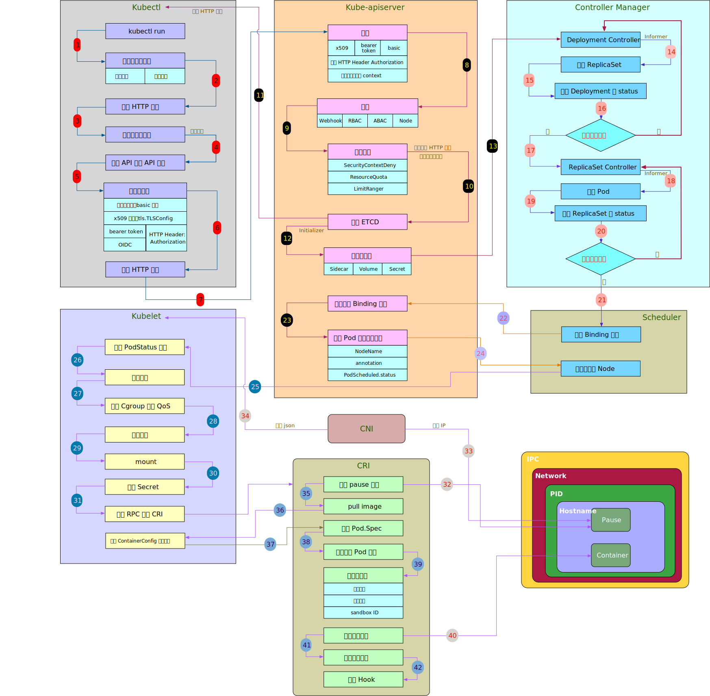

### K8s整体框架

#### master-node结构

##### 控制面

* **etcd** 保存整个集群状态；
* **kube-apiserver** 提供了资源操作的唯一入口，并提供认证、授权、访问控制、API 注册和发现等机制。并且无论是集群内部还是外部的组件，都必须通过 API Server 来访问数据；
* **kube-controller-manager** 负责维护集群的状态，包括很多资源的控制器，这些控制器是保证 Kubernetes 声明 API 工作的大脑，比如故障检测、自动扩展、滚动更新等；
* **kube-scheduler** 负责资源的调度，按照预定的调度策略将 Pod 调度到相应的 Node 上。

##### Node节点

* **kubelet** 负责维持容器的生命周期，同时也负责 Volume（CSI）和网络（CNI）的管理；
* **Container runtime** 负责镜像管理以及 Pod 和容器的真正运行（CRI），默认的容器运行时为 Docker；
* **kube-proxy** 负责为 Service 提供 Cluster 内部的 Service Discovery 和负载均衡；
* **Network plugin** 负责为容器配置网络。

### K8s声明式对象

#### Pod

##### Pod的创建过程

`参考资料：https://icloudnative.io/posts/what-happens-when-k8s/`

* 输入`$ kubectl run --image=nginx --replicas=3`命令后，kublet首先会进行**验证请求是否合法**操作，并使用**生成器**将发送给kube-apiserver的HTTP请求进行封装，将**用户名和密码**等信息发送；
* api-server收到HTTP请求后将用户信息添加到上下文中完成**（用户的）认证**，随后通过一系列**授权者**验证请求是否有权利被执行（任一授权者通过即可）；
* **准入控制链**的每一个控制器确认该请求所对应的事件允许发生时（任一控制器拒绝则全盘拒绝），api-server将反序列化请求并以此构建运行时对象，保存到**etcd**中；
* 遍历初始化配置后，Pod的metadata.initializers.pending字段会添加相应的字段，每一个Initializer会定期扫描新的Pod，执行自己的逻辑以**初始化**，后将pending中对应字段删除；
* Deployment记录已经保存在etcd当中，**Deployment Controller**会收听Deployment的变更事件（控制器通过**Informer**建立的回调函数），并验证此Deployment的状态是否达到**期望状态**。此处发现无对应Pod和ReplicaSet与其关联，则创建ReplicaSet资源并更新status，等待新一轮循环；
* **ReplicaSet Controller**检测到相应变更时间后，类似的，以一种slow start的方式（以防止大量请求吞没api-servier）创建Pod资源，并设置Pod的`metadata.OwnerReferences`属性，方便垃圾回收器回收无主的Pod；
* etcd此时已保存一个Deployment，一个ReplicaSet和3个Pod资源记录，但此时Pod资源处于Pending状态。**Scheduler**将通过**预选**（是否满足对应Pod的要求）和**优选**（对满足要求的节点进行一系列流程打分）找到合适的节点，并将其发送给apiserver；
* Pod此时将被调度到合适的节点，此节点的kublet将开始同步Pod，生成PodStatus对象表示其当前阶段的状态（Pending/Running/Succeed/Failed/Unkown），串行执行**同步器（PodSyncHandlers）**以验证该Pod是否应该运行在当前节点上，串行运行**准入处理器**来确保该Pod具备相应的权限，为其创建**cgroup**来进行资源限制，为其**创建相应目录**，为其进行**卷挂载**等；
* kubelet完成初始化工作后将RPC调用**CRI（容器运行时）**的RunPodSandbox以完成容器的启动。首先**pause容器**将被启动以为整个Pod的容器提供相同的命名空间（网络，IPC等）；
* **容器网络接口（CNI）**将给pause 容器配置相关网络，Pod中其他容器共享pause的网络；
* 配置完成后首先启动**PodSpec**中定义的**init容器**，随后启动应用容器；
* Pod启动后，集群会在InitialDelaySeconds内等待Pod的启动和初始化，然后进行健康检查。在连续的失败后就会改变当前Pod的状态，也是为了避免服务不稳定带来的抖动。

##### 容器之间的通信

**同一Pod中的容器之间的通信**：Pod创建后，pause容器会申请网络命名空间，整个Pod的容器都会共享pause的网络命名空间。随后CNI将为Pod分配一个IP地址，并创建veth将Pod的网络命名空间和根网络命名空间相连接。同一Pod中的容器共享IP，分配不同的端口，可以直接通过localhost访问。

**Pod到Pod之间的流量转发：**

* Pod 流量的目的地是同一节点上的 Pod：Pod-A 将数据包发送到其默认接口 eth0，这个接口与 veth 对的一端绑定。这样，数据包会被转发到节点上的根命名空间。以太网网桥通过ARP协议将数据包转发到PodB中。

* Pod 流量的目的地是不同节点上的 Pod：当目的 IP 不在本地网络中时，报文被转发到节点的默认网关。节点的出口网关或默认网关，通常位于节点与网络相连的物理接口 eth0 上。

**Pod 到 Service 的流量：**原始的请求依然在在 Pod-A 命名空间的 eth0 接口发出，通过veth达到根命名空间的网桥。此时，在路由之前，Netfilter将执行 iptables 规则，修改Pod-A数据包的目标IP地址（即通过iptables，实现了Service与其Spec中规定的PodIP的映射）。接下来，数据包路由过程与 Pod 到 Pod 的通信一样。

#### Service

##### Service的逻辑

Service对象部署在etcd后

* **ServiceController**仅仅处理**LoadBalancer**类的Service资源
* **EndpointController**监听的不是Endpoint，而是**Service**和**Pod**的资源调动。EndpointController根据Service的标签选择器选取所有和的Pod，并根据Service书写的规则，将Pod的端口和Service的端口进行映射，生成一个EndpointPort实体；每一个Pod都会生成一个**EndpointSubset**，包含Pod的IP地址和端口和Service的Spec指定的输入端口和目标端口；（即EndpointController主要是根据Pod和Service对具体的Endpoint进行变更）
* 节点上的kube-proxy会创建**ServiceConfig**和**EndpointConfig**对象，其会订阅Service和Endpoint的变更，并推送给**Proxier**实例，以此更新iptables或者ipvs中的规则(以控制流量的路由)

#### 垃圾回收器

##### 垃圾回收期工作原理

垃圾收集主要提供的功能就是级联删除，它向对象的 API 中加入了 `metadata.ownerReferences`字段，这一字段会包含当前对象的所有依赖者，在默认情况下，如果当前对象的所有依赖者都被删除，那么当前对象就会被删除

* GarbageCollector 以协程的方式运行并监听几乎所有资源变动，当发生事件后会调用`attemptToDeleteItem`或者`attempteToOrphanItem`的方法对其处理
* 当对象不包含任何依赖时，将查看其终结器列表，当每个终结器运行后会从终结器列表中删除自己，当终结器列表为空时才能真正删除一个对象

#### Deployment

Deployment实际上是ReplicaSet的组合，解决了 ReplicaSet 更新的诸多问题，通过对 ReplicaSet 和 Pod 进行组装支持了滚动更新、回滚以及扩容等高级功能。

#### StatefulSet

StatefulSet 是 Kubernetes 为了处理有状态服务引入的概念，在有状态服务中，它为无序和短暂的 Pod 引入了顺序性和唯一性，使得 Pod 的创建和删除更容易被掌控和预测，同时加入 PV 和 PVC 对象来存储这些 Pod 的状态。

Pod 的序列号（Ordinal）是其唯一性和顺序性的保证，在创建和删除 StatefulSet 的副本时，我们都需要按照 Pod 的序列号对它们按照顺序操作，副本的创建会按照序列号升序处理，副本的更新和删除会按照序列号降序处理。

#### DaemonSet

DaemonSet 可以保证集群中所有的或者部分的节点都能够运行同一份 Pod 副本，每当有新的节点被加入到集群时，Pod 就会在目标的节点上启动，如果节点被从集群中剔除，节点上的 Pod 也会被垃圾收集器清除；
