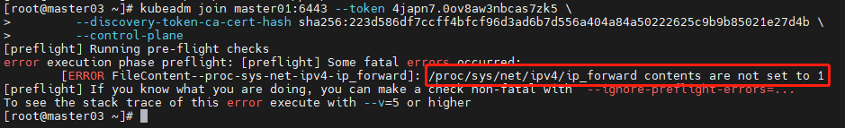

## 记录：第一次实践搭建k8s集群

每次配置都会因为各种原因踩坑，此处记录一下遇到的问题和解决方案方便之后复现。考虑重复操作的复杂性，选择先准备在一台虚拟机上准备好环境后进行克隆。

#### 搭建CentOS系统并配置网络

##### 虚拟机配置

| 工作站 | VMware Workstation 17.5.2 |
| ------ | ------------------------- |

官网下载需要注册账号，网络上有提供网盘的下载链接

```
下载地址： https://blog.csdn.net/SHERLOCK0226/article/details/139748840
```

下载后选择个人版就可免费使用

##### 系统配置

| 系统版本 | Cent OS 7.9                                             |
| -------- | ------------------------------------------------------- |
| 镜像地址 | https://mirrors.aliyun.com/centos/7.9.2009/isos/x86_64/ |

##### 虚拟机配置网络

* 网络连接模式选择NAT模式


* 点击VMware->编辑->虚拟网络编辑器，记录虚拟机配置的子网地址，可供分配的IP为192.168.40.0-192.168.40.255


* 安装好系统并重启后，修改网关配置并重启网络

```bash
# 修改网关配置
vi /etc/sysconfig/network-scripts/ifcfg-ens33
```


`BOOTPROTO=static`开启静态IP

`ONBOOT=yes`开机启动网络

`IPADDR=192.168.40.30`为此台机器配置的IP

`NETMASK=255.255.255.0`子网掩码，C类内网IP的固定配置

`GATEWAY=192.168.40.2`网关

`DNS`域名解析器

* `192.168.40.2`自己的网关
* `114.114.114.114`国内通用DNS地址
* `8.8.8.8`世界通用DNS地址

```bash
# 重启网络服务
service network restart

# 查看网络连通状态，发现正常
ping baidu.com
```

##### 配置SSH方便操作和查看

下载MobaXterm连接虚拟机

```
下载地址：https://mobaxterm.mobatek.net/download-home-edition.html
Session连接时Remote Host选择刚刚配置的静态IP：192.168.40.30
```

#### k8s环境准备

##### 环境准备

* 所有机器关闭防火墙

```bash
systemctl stop firewalld
systemctl disable firewalld
```

* 关闭selinux安全模块

```bash
sed -i 's/enforcing/disabled/' /etc/selinux/config 
setenforce 0
```

* 关闭交换空间

```bash
swapoff -a
sed -ri 's/.*swap.*/#&/' /etc/fstab
```

* 在所有主机上将桥接的ipv4流量传递到iptables的链

```bash
cat > /etc/sysctl.d/k8s.conf << EOF
net.bridge.bridge-nf-call-ip6tables = 1
net.bridge.bridge-nf-call-iptables = 1
EOF
```

##### 安装Docker

* 配置yum源加速下载

```bash
curl -o /etc/yum.repos.d/CentOS-Base.repo https://mirrors.aliyun.com/repo/Centos-7.repo
```

* 下载Docker

```bash
yum install docker-ce-20.10.11 -y

# 启动docker服务
systemctl start docker
systemctl enable docker
```

* 配置Docker镜像

```bash
vi /etc/docker/daemon.json

修改为
{
  "exec-opts": ["native.cgroupdriver=systemd"],
  "registry-mirrors": ["http://docker.m.daocloud.io", "http://hub-mirror.c.163.com", "https://cr.console.aliyun.com/"]
}

# 重启docker服务
systemctl daemon-reload
systemctl restart docker
```

* 查看Docker安装结果

```
docker -v
```

##### 集群部署

修改仓库，安装kubeadm、kubelet、kubectl

- `kubeadm`：用来初始化集群的指令。
- `kubelet`：在集群中的每个节点上用来启动 Pod 和容器等。
- `kubectl`：用来与集群通信的命令行工具。

```bash
cat <<EOF > /etc/yum.repos.d/kubernetes.repo
[kubernetes]
name=Kubernetes
baseurl=https://mirrors.aliyun.com/kubernetes/yum/repos/kubernetes-el7-x86_64/
enabled=1
gpgcheck=1
repo_gpgcheck=1
gpgkey=https://mirrors.aliyun.com/kubernetes/yum/doc/yum-key.gpg https://mirrors.aliyun.com/kubernetes/yum/doc/rpm-package-key.gpg
EOF

yum install kubelet-1.22.2 kubeadm-1.22.2 kubectl-1.22.2 -y
systemctl enable kubelet && systemctl start kubelet
```

#### 配置k8s集群并解决故障

此时已准备好单台机器，在VMware上将准备好的机器克隆三台，此次将配置一个四节点k8s集群（master * 3 + node * 1），具体规划如下

| master01    | 192.168.40.30 |
| ----------- | ------------- |
| master02    | 192.168.40.31 |
| master03    | 192.168.40.32 |
| node01      | 192.168.40.33 |
| Pod网段     | 10.244.0.0/16 |
| Service网段 | 172.16.0.0/16 |

* 在每一台克隆好的机器根据其**名称**和**分配的IP**，按照前面的步骤修改其`ifcfg-ens33`中的静态IP`IPADDR`，设置主机名`hostnamectl set-hostname 主机名`
* 重启网络，然后使用SSH连接好剩下三台电脑。
* 对每一台电脑修改其hosts

```
vi /etc/hosts

192.168.40.30 master01
192.168.40.31 master02
192.168.40.32 master03
192.168.40.33 node01
```

##### 部署主节点

* 在master01节点上运行初始化命令，注意配置的**静态IP**和**主机名**

```
kubeadm init \
--apiserver-advertise-address=192.168.40.30 \
--image-repository registry.aliyuncs.com/google_containers \
--kubernetes-version v1.22.2 \
--control-plane-endpoint master01 \
--service-cidr=172.16.0.0/16 \
--pod-network-cidr=10.244.0.0/16
```

* 成功后将得到后续节点的加入命令


* 执行要求的命令

```bash
mkdir -p $HOME/.kube
sudo cp -i /etc/kubernetes/admin.conf $HOME/.kube/config
sudo chown $(id -u):$(id -g) $HOME/.kube/config
export KUBECONFIG=/etc/kubernetes/admin.conf
```

* 配置集群网络，安装CNI插件

```bash
# 下载CNI插件配置
curl https://calico-v3-25.netlify.app/archive/v3.25/manifests/calico.yaml -O
```

* 修改calico.yaml，找到`CALICO_IPV4POOL_CIDR`字段并将其修改为之前配置的Pod网络


* 应用calico网络插件

```bash
kubectl apply -f calico.yaml
```


**问题出现并解决-ErrImagePull/ImagePullBackOff**

* `kubectl get nodes`发现主节点长期NotReady
* `kubectl get pods -n kube-system`查看系统命名空间下的pod以查看问题，发现网络插件出现`ErrImagepull`或者`ImagePullBackOff`代表容器拉去出现了问题在反复重试，记住对应pod名称
* `kubectl describe pod pod名称 -n kube-system`找到拉取的具体镜像


* 直接在对应机器上使用docker拉取`docker pull calico/cni:v3.25.0`，问题解决

##### 部署其余节点

在master02/master03机器上输入之前的注册master的代码，在node01机器上输入注册node work节点的代码，使其连接到集群，最终成功部署后查看`kubectl get nodes`


**问题出现并解决-“/proc/sys/net/ipv4/ip_forward contents are not set to 1”**

* 注册失败并出现



* 更改转发规则并重启网络

```
echo "1" > /proc/sys/net/ipv4/ip_forward
service network restart
```

* 问题解决


**问题出现并解决-master注册发现failure loading certificate for CA: couldn‘t load the certificate fil**

* 注册失败并出现


* 在master02/master03上建立目录`mkdir /etc/kubernetes/pki/etcd`并在master01上复制证书

```bash
scp -rp /etc/kubernetes/pki/ca.* master02:/etc/kubernetes/pki
scp -rp /etc/kubernetes/pki/sa.* master02:/etc/kubernetes/pki
scp -rp /etc/kubernetes/pki/front-proxy-ca.* master02:/etc/kubernetes/pki
scp -rp /etc/kubernetes/pki/etcd/ca.* master02:/etc/kubernetes/pki/etcd
scp -rp /etc/kubernetes/admin.conf master02:/etc/kubernetes
```

* 问题解决


**踩坑：`kubeadm reset`后出现Unable to connect to the server: x509:**

* matser节点连接后都需要执行以下命令

```bash
mkdir -p $HOME/.kube
sudo cp -i /etc/kubernetes/admin.conf $HOME/.kube/config
sudo chown $(id -u):$(id -g) $HOME/.kube/config
```

* 然而重新创建集群时，以上目录依旧存在，所以要在执行这些命令之前执行`rm -rf $HOME/.kube`
* 问题解决


#### 安装DasBoard可视化监控集群

* 安装DashBoard

```bash
kubectl apply -f https://raw.githubusercontent.com/kubernetes/dashboard/v2.0.3/aio/deploy/recommended.yaml
```

* 将DashBoard的服务设置为NodePort使其暴露出来

```bash
kubectl patch svc kubernetes-dashboard -p '{"spec":{"type":"NodePort"}}' -n kubernetes-dashboard
```

* 查看DashBoard端口号

```bash
kubectl get svc -n kubernetes-dashboard
```


* 在访问任意一台机器，此处访问`192.168.40.30:31520`发现需要配置token登录
  * 创建ServiceAccount,根据其管理目标,使用rolebinding或clusterrolebinding绑定至合理role或clusterrole
  * 获取到此ServiceAccount的secret,查看secret的详细信息,其中就有token

```bash
kubectl create serviceaccount dashboard -n kubernetes-dashboard
kubectl create rolebinding def-ns-admin --clusterrole=admin --serviceaccount=default:def-ns-admin
# kubectl create clusterrolebinding dashboard-cluster-admin --clusterrole=cluster-admin --serviceaccount=kubernetes-dashboard:dashboard
kubectl describe sa dashboard -n kubernetes-dashboard

查看后获得
Name:                dashboard
Namespace:           kubernetes-dashboard
Labels:              <none>
Annotations:         <none>
Image pull secrets:  <none>
Mountable secrets:   dashboard-token-zm6rs
Tokens:              dashboard-token-zm6rs
Events:              <none>
```

* 将对应Token输入到页面中后，配置成功

